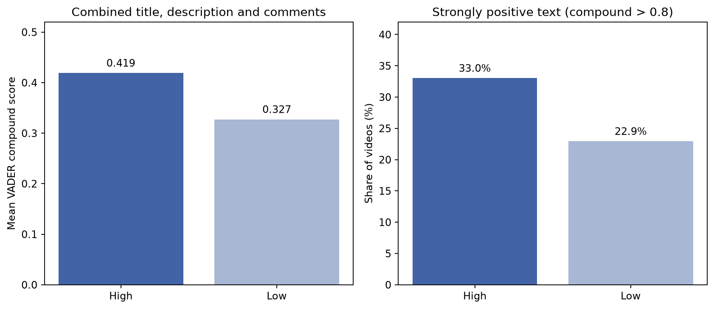
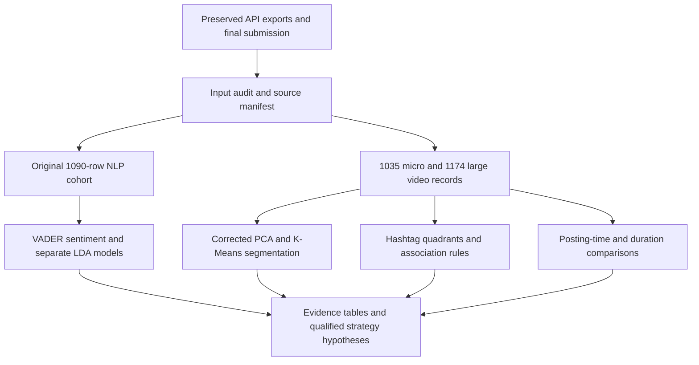

# ZeroToViral

### YouTube market entry strategy for micro-creators

An exploratory analytics project examining how creators with fewer than 10,000 subscribers position their content, use hashtags, and choose publication times. The study combines YouTube API data, market segmentation, sentiment analysis, topic modeling and association rules to turn a broad growth question into testable creator decisions.

**The strongest finding is a difference in audience engagement and content language within the sampled videos.** Higher-like-rate videos contain more positive combined text and more identity-specific vocabulary. Hashtag quantity shows only a weak relationship with like rate, and many attractive posting windows have too few observations to support a universal schedule. The project provides strategy hypotheses and an evidence framework; it does not establish causal growth effects.

[Detailed case study](docs/CASE_STUDY.md) · [中文项目复盘](docs/RETROSPECTIVE_ZH.md) · [Findings and corrections](docs/EVIDENCE_AUDIT.md) · [Reproduce the analysis](docs/REPRODUCIBILITY.md)

## Results at a glance

| Research area | Evidence | What it supports |
|---|---|---|
| **Content sentiment** | Mean VADER compound **0.419 vs 0.327**; strongly positive text **33.03% vs 22.94%** in High/Low like-rate groups | An observed language/engagement association. Scores include audience comments. |
| **Content differentiation** | Largest LDA topic share **26.79% vs 38.90%**; topic entropy **1.565 vs 1.507** | The Low group is more concentrated under the fitted models. Topic concentration is not a direct measure of market saturation. |
| **Hashtag strategy** | Golden quadrant: **226 / 1,035 videos**. Hashtag-count Pearson **r = −0.0234, p = 0.452** | Evaluate reach and like rate separately; rule co-occurrence does not prove performance lift. |
| **Timing** | Monday 09:00 UTC: median **1,283 views, n = 12**. Sunday 00:00 ranks higher but has **n = 1**. | Sample size changes which scheduling hypotheses deserve testing. |
| **Market segmentation** | Corrected four-cluster model on **2,209 video records**, with diagnostics for K=2–8 | Different performance profiles, with four clusters retained for interpretability and historical comparison. |

These values come from committed [recomputed tables](results/tables/). Historical results and reconstruction changes are distinguished in the [evidence audit](docs/EVIDENCE_AUDIT.md).



## The business question

New creators must decide what to make before they have reliable channel analytics. This project asks which observed patterns can inform three decisions: content positioning, metadata choices, and posting schedules. Views measure accumulated reach; like rate measures likes per recorded view. Neither directly measures retention, audience satisfaction, subscriber growth or revenue.

The project is a **team academic study for Machine Learning II**. The original presentation credits Nawakamol Rojanabenjakun, Min Yuan Shih, Kimberly Huang, Xinyue Fan and Sheena Chen. The supplied material does not establish individual workstream ownership; the repository therefore credits the team without attributing all work to one contributor.

## Data and analysis design

| Snapshot or cohort | Video records | Unique channels | Role |
|---|---:|---:|---|
| Earliest retained micro export | 1,108 | 1,071 | Includes duplicate video IDs and precomputed features |
| Micro preprocessing snapshot | 1,090 | 1,053 | Original NLP sample; 545 High / 545 Low |
| Quantitative micro cohort | 1,035 | 1,001 | Positive views, valid like rate and positive subscriber count |
| Large-channel snapshot | 1,177 | 1,146 | Original benchmark export |
| Quantitative large cohort | 1,174 | 1,143 | Benchmark after enforcing ≥10,000 subscribers |

The micro publication timestamps span February 16, 2025 through April 14, 2026. **These are publication dates, not collection dates.** A reliable collection timestamp was not preserved. Keyword-driven searches favor vlog, student and daily-life content, and the text shows substantial Indian cultural and exam-preparation vocabulary. This is not a representative sample of YouTube.



## Read the project

| Material | Purpose |
|---|---|
| [Case study](docs/CASE_STUDY.md) | Problem, analytical choices, detailed findings, business implications and next experiments |
| [中文复盘](docs/RETROSPECTIVE_ZH.md) | 完整中文复盘，覆盖最终发现、方法问题与项目价值 |
| [Evidence audit](docs/EVIDENCE_AUDIT.md) | Claim-by-claim reconciliation of report, notebooks and reconstructed results |
| [Data dictionary](docs/DATA_DICTIONARY.md) | All snapshot fields, transformations, cohort definitions and missingness |
| [Reproducibility guide](docs/REPRODUCIBILITY.md) | Environment, execution, model specifications and known limits |
| [Results index](results/README.md) | Reviewed charts, numerical tables and run provenance |
| [Original final report](reports/original/final-report-original.docx) | Submitted Word report, preserved unchanged |
| [Original presentation](reports/original/presentation-original.pptx) | Submitted slide file, including duplicates and template remnants |
| [Source archive](archive/README.md) | Final/working notebooks, proposal material, prior GitHub version and 19-file provenance manifest |

## Run it

```bash
python3 -m venv .venv
source .venv/bin/activate
python -m pip install -r requirements.txt
python -m nltk.downloader -d .cache/nltk_data vader_lexicon
python scripts/analyze.py
python scripts/validate_repository.py
```

No API key is needed to reproduce the committed-data analysis after dependency and lexicon setup. Numbered [notebooks](notebooks/) call the same maintained implementation. Fresh collection is optional and explicitly gated. See [execution details](docs/REPRODUCIBILITY.md).

```text
ZeroToViral/
├── README.md
├── docs/                 # Case study, Chinese retrospective, audit, data dictionary
├── data/                 # Four unchanged input snapshots
├── notebooks/            # Six documented entry points
├── scripts/              # Reproducible analysis and evidence validation
├── results/              # Recomputed tables, five charts and run manifest
├── reports/original/     # Original final report and presentation
├── archive/              # Submitted and previous public versions, source manifest
└── requirements*.txt     # Dependency ranges and observed environment
```

## Retrospective and research limits

The October 6, 2026 reconstruction added the missing final artifacts, reconciled sample counts, rebuilt the analysis, and corrected unsupported interpretations. It preserved the original evidence rather than presenting revised results as historical outputs.

The study is cross-sectional, search-selected and partly dependent on multiple videos from the same channel. Public view counts have different accumulation periods. VADER mixes creator text with audience responses, and English/ASCII processing incompletely captures multilingual content. Small cells, hand-labeled tag types and separately fitted LDA models require careful interpretation. The original materials do not demonstrate creator growth, causal uplift or a deployed recommendation system.

YouTube metadata tags and visible hashtags are different fields; the tag-strategy analysis primarily uses title/description hashtags. Duration bins are analytical conventions and do not identify official Shorts. See the [API field reference](https://developers.google.com/youtube/v3/docs/videos) and [YouTube's Shorts guidance](https://support.google.com/youtube/answer/15424877).

Original authorship remains with the project team. Third-party video metadata and comment excerpts retain their original rights. This reconstruction does not add a blanket license for those materials.
