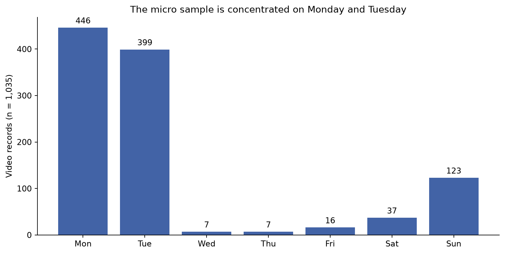
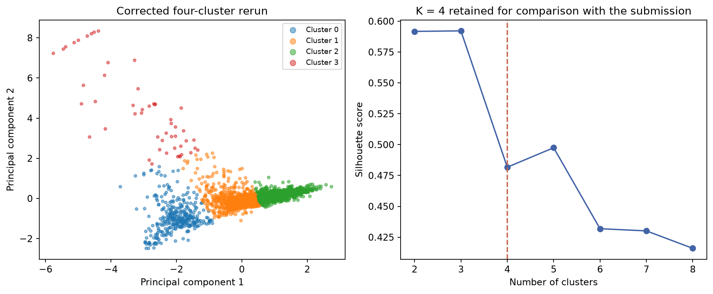
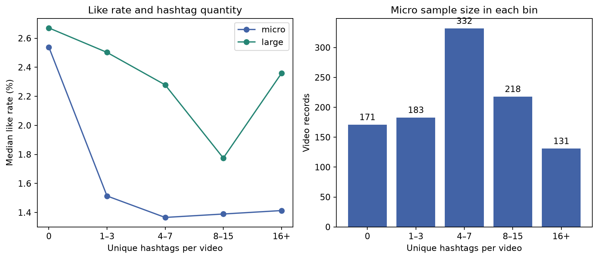
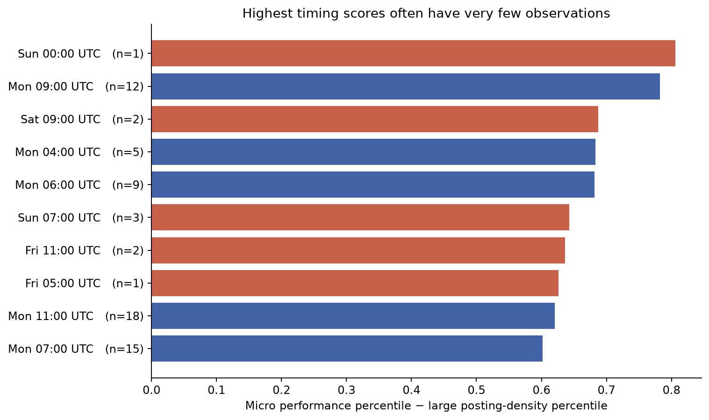

# YouTube market entry strategy for micro-creators

## Executive perspective

ZeroToViral investigates a practical problem: a new creator must make content and distribution decisions before having enough channel-specific evidence to know what works. The team assembled YouTube video metadata and public engagement measures, compared micro-creators with larger channels, and examined market profiles, language, hashtags and publication timing.

The clearest reproduced findings concern **differences within the sampled content**. Videos in the higher-like-rate half contain more positive combined text and distinctive cultural or identity vocabulary. Their fitted topics are more evenly distributed. Hashtag analysis separates videos with reach from videos with a higher share of likes, while posting-time analysis identifies candidate windows whose reliability depends heavily on sample size.

The original report translated those findings into a creator playbook. This retrospective retains the useful decision framework and qualifies claims that the data cannot establish: no intervention was run, no channel growth was tracked over time, and public view counts do not reveal recommendation impressions, retention or revenue. The result is an exploratory strategy study with an auditable set of hypotheses.

## 1. Project context and intended decisions

The target user is a creator with fewer than 10,000 subscribers. The project considers larger channels as a benchmark, while recognizing that their reach, history and audience base differ substantially. The 10,000-subscriber boundary is an analytical segmentation choice, not a platform policy threshold.

The main question is: **What can observed content and engagement patterns tell a micro-creator about positioning, metadata and scheduling?** Four workstreams translate that question into narrower analyses.

| Workstream | Decision supported | Analytical approach | Directly observed outcome |
|---|---|---|---|
| Market landscape | Which performance profile describes a content strategy? | Log transforms, standardization, PCA and K-Means | Groups of videos with different duration, like rate and views per subscriber |
| Language and topics | How does content differ between high- and low-like-rate videos? | VADER, token contrasts, bigrams and LDA | Text sentiment, vocabulary frequency and topic shares |
| Hashtag strategy | How do reach and engagement differ across hashtag choices? | Median-based quadrants, tag ranking and Apriori | Views, like rate and within-group hashtag co-occurrence |
| Timing and duration | Which publication windows merit channel-specific testing? | Weekday/hour aggregation and rank differences | Median accumulated views and sampled posting density |

Success for this study means useful, transparent evidence and a defensible next experiment. It does not mean demonstrating that following the recommendations will make a channel viral.

## 2. Source reconstruction and data foundation

The supplied project material contained a final Word report, a 43-slide presentation, final and working notebooks for each analytical phase, preprocessing exports, and an earlier Data Architect phase. The previous public repository had notebooks and data, but lacked the final report and presentation and mixed findings from different analytical versions.

The reconstruction inventories 19 source files. Four CSVs exactly match files already in the public repository. All supplied sources are now mapped to maintained repository locations with SHA-256 hashes. Original report and slide bytes remain unchanged. A literal API credential was removed from the public copy of the original collection notebook; the local source remains untouched. The [source archive](../archive/README.md) preserves both the submission and the earlier GitHub notebooks.

### Collection strategy

The micro collector uses YouTube Data API searches for 15 phrases, including “first vlog,” “small youtuber,” “study vlog,” “day in my life,” “college vlog,” “what i eat in a day” and “new vlogger.” It requests up to two pages per query, ordered by date, deduplicates candidate video IDs, retrieves video/channel statistics, filters channels, and requests up to ten relevant top-level comments per retained video. Its target is 1,200 rows; a target is not the achieved sample size.

The earliest retained micro CSV contains 1,108 rows and 1,090 unique video IDs. The preprocessing CSV contains 1,090 unique video records. Its publication dates run from February 16, 2025 to April 14, 2026. Collection time was not reliably preserved, so the age of each video at measurement cannot be calculated accurately. The large-channel file contains 1,177 records; a 1,200-row proposal dataset is also archived, but the complete large-channel collection pipeline is not available.

### Cohorts and unit of analysis

The NLP work uses the original 1,090-row snapshot, split into 545 High and 545 Low records using the stored like-rate labels. The quantitative reconstruction uses 1,035 micro records after enforcing positive views, a like rate between zero and one, and subscribers between one and 9,999. The comparable large cohort contains 1,174 records after excluding three below-threshold channels.

These are video-level analyses. The 1,035 micro videos represent 1,001 unique channels; the 1,174 large videos represent 1,143 channels. Repeated videos from the same channel can violate independence assumptions. Historical references to the number of “creators” should not be interpreted as counts of unique people or channels.

### Measurement quality

Only 57.2% of the quantitative micro cohort has a nonempty description, 30.4% has metadata tags, and 38.8% has stored top-comment text. Missing metadata is not necessarily a collection error, and an absent comment excerpt does not prove that a video has no comments. Metadata tags and visible hashtags are distinct fields, as reflected in the [YouTube video resource specification](https://developers.google.com/youtube/v3/docs/videos). Most tag-strategy computations here use hashtags extracted from titles and descriptions.

The dataset is strongly shaped by the search phrases and the date-ordered collection method. Monday and Tuesday account for 81.64% of the quantitative micro videos, and Indian exam-preparation and cultural vocabulary is prominent. Geography was not independently labeled, so these text patterns should not be treated as verified nationality counts.

## 3. Market segmentation and the importance of consistent features

The original exploration moved through an early three-cluster model and a final four-archetype narrative: Rising Stars, Community Builders, Authority Archives and Viral Elite. The analytical motivation was sensible: raw view counts largely reflect size, so the team considered performance ratios and duration to describe different content profiles.

However, the submitted notebook mixes `views / (subscribers + 1)` with a later assignment of `like_rate / view_count` under the same efficiency column name. It also relies on undefined state and carries labels across a PCA refit. Consequently, the original efficiency magnitudes and “growth lever” ratios cannot be accepted as a consistent final model.

The corrected rerun specifies the intended ratio explicitly: views divided by subscriber count plus one. It applies `log1p` to that ratio, like rate and duration, standardizes the three features, reduces them to two principal components, and fits four clusters with a fixed random seed. The components retain approximately 80.24% of the standardized transformed variance.

| Corrected cluster ID | Videos | Mean duration | Mean like rate | Mean views / (subscribers + 1) | Reading of the profile |
|---|---:|---:|---:|---:|---|
| 0 | 338 | 4,384.4 sec | 6.28% | 0.442 | Long-duration profile |
| 1 | 964 | 58.3 sec | 2.93% | 4.956 | Broad shorter-duration profile |
| 2 | 856 | 34.5 sec | 1.79% | 145.543 | High views relative to subscriber count |
| 3 | 51 | 189.3 sec | 52.67% | 0.604 | High like-rate, very low-view profile |

Cluster 3 has a median of only **five views**. This materially changes the interpretation of its 52.67% mean like rate: small denominators can produce extreme engagement ratios. Calling this proof of a superior community strategy would overstate the evidence. A next version should use a minimum-exposure threshold or shrinkage for rates and examine whether the group remains stable.

The four-cluster result is an interpretive decomposition. The corrected diagnostic favors three clusters by silhouette among K=2–8: 0.592 for K=3 compared with 0.482 for K=4. Four is retained to make the original project framing comparable, not because it wins every selection criterion. Cluster numbers are arbitrary and should not be carried between model versions without remapping.

The historical “blue ocean” chart places Pets & Animals favorably relative to People & Blogs using average views divided by sampled video count. The chart's values are hard-coded, the sampling frame heavily favors vlogs, and cumulative views differ by age and channel scale. This can motivate a category comparison, but cannot establish total market demand, creator supply or low acquisition costs.

**Decision implication:** use profiles to describe trade-offs worth exploring. Do not infer retention from duration, labor productivity from views per subscriber, or a growth lifecycle from cross-sectional clusters.

## 4. Language, sentiment and content differentiation

### Sentiment results reproduce

The saved NLP specification joins each video's title, description and top comments before applying VADER. Raw punctuation and capitalization are retained for sentiment. The original 545/545 group split produces the following results in the current rerun.

| Metric | High like-rate group | Low like-rate group |
|---|---:|---:|
| Mean full-text compound score | 0.419069 | 0.327392 |
| Share with compound >0.8 | 33.03% | 22.94% |
| Mean title/description-only compound score | 0.302182 | 0.267554 |

The full-text gap is approximately 0.0917, and the strongly positive share differs by 10.09 percentage points. Removing comments reduces the mean-score gap to 0.0346. Because comments are audience reactions, the combined-text result cannot be interpreted purely as a creator's controllable writing style. This sensitivity check supports a more precise conclusion: higher-like-rate videos have more positive surrounding text, with audience responses contributing to the observed contrast.

No causal or statistical significance claim is attached to the sentiment difference. Grouping by like rate also means that the comparison is outcome-selected rather than a prospective prediction test.

### Distinctive vocabulary

After removing the submitted custom stopword set, the largest High-minus-Low token-frequency contrast is `jee`, at 0.6569 tokens per video. `haridwar`, `shayari`, `iit`, `assamese` and `aspirant` are also more common in the High group. Low-group contrasts include `food`, `ssc`, `class`, `upsc` and `aesthetic`.

The useful strategic idea is audience specificity, rather than copying words from a successful group. The vocabulary reflects the corpus's cultural and educational context. For example, `assamese` is rare but nonzero in the Low group, contrary to the original report's exclusive-language claim. Token counts can also be driven by repetition within a small number of videos.

### Topic modeling

Separate five-topic LDA models use title and description only, with a maximum vocabulary of 1,000 terms and a minimum document frequency of two. The dominant-topic distributions reproduce the saved results.

| Topic index within its group | High share | Low share |
|---|---:|---:|
| 1 | 22.94% | 38.90% |
| 2 | 18.90% | 12.66% |
| 3 | 26.79% | 19.45% |
| 4 | 21.47% | 15.05% |
| 5 | 9.91% | 13.94% |
| Distribution entropy | 1.5648 | 1.5071 |

Topic 1 in one group is not the same topic as Topic 1 in the other. The original interpretation describes Hindi culture, small-creator journeys and exam-preparation life in the High model, with daily routines and aesthetics prominent in the Low model. The concentration contrast is descriptive. It does not directly measure market saturation or prove that a creator should divide uploads into five equally sized pillars.

The final bigram code uses filtered full-text tokens from videos with compound >0.8. It does not implement the report's comment-only >0.5 procedure. Stopword deletion also creates new token adjacency. Repeated bigrams are therefore insufficient evidence of spam or inauthentic engagement.

**Decision implication:** test a clearly defined audience promise and a consistent voice. Measure the response on the creator's own channel before concluding that a particular emotional tone or niche vocabulary improves results.

## 5. Hashtag strategy across reach and engagement

The tag analysis's most useful contribution is separating accumulated views from like rate. Median splits create four groups in the reconstructed micro cohort.

| Quadrant | Video records | Interpretation |
|---|---:|---|
| Golden | 226 | Above/equal median views and like rate |
| Exposure Trap | 292 | Above/equal median views, below median like rate |
| Niche | 292 | Below median views, above/equal median like rate |
| Ineffective | 225 | Below both medians |

These labels are shorthand for relative sample positions. They are not absolute measures of business effectiveness or viewer quality.

Tag rankings require at least ten videos per tag. The original report grouped top tags into identity, content-specific, audience-descriptor and format-chasing categories, with an additional ambiguous category in code. The frequently repeated “74%” headline adds rounded category percentages; the underlying 11 of 15 tags is 73.3%. Labels and some figure weights were entered manually, so the maintained pipeline exports factual tag rankings without treating the taxonomy as an automatic classifier.

### Association rules

Apriori runs within Golden, Exposure Trap and Niche groups using support 0.025 and lift 1.3. Only videos with two or more hashtags qualify as transactions: 186 Golden, 270 Exposure Trap and 200 Niche videos. A pattern such as `food → shorts + whatieatinaday` appears in the Golden group with support about 2.69%, approximately five eligible videos. Such small support counts are easy to overinterpret even when lift is large.

The original recommendation to combine a relevant format tag with content-specific tags is a testable hypothesis. The rule analysis does not prove that the combination creates high engagement; videos were already selected by their outcomes before the tags were mined.

### Quantity results and sensitivity

Stored hashtag count has essentially no linear relationship with like rate in this sample: Pearson r=−0.0234, p=0.452. Spearman r=−0.118 suggests a weak monotonic relationship. Controlling for views, subscriber count and duration leaves a residual correlation of −0.0229 with p≈0.462 under adjusted degrees of freedom. Neither the observed pattern nor the nonsignificant linear estimate establishes a causal effect.

The historical quantity table does not account for all declared cohort rows and lacks its bin-construction code. The maintained output therefore defines unique parsed hashtag counts explicitly and accounts for every record.

| Unique hashtags | Micro videos | Median views | Median like rate |
|---|---:|---:|---:|
| 0 | 171 | 259 | 2.54% |
| 1–3 | 183 | 878 | 1.51% |
| 4–7 | 332 | 918.5 | 1.37% |
| 8–15 | 218 | 760 | 1.39% |
| 16+ | 131 | 934 | 1.41% |

This comparison displays a reach/like-rate trade-off and considerable scope for confounding. It does not show a monotonic dose-response or an optimal universal tag count.

**Decision implication:** use relevant hashtags and test a small set of metadata strategies while holding content type reasonably consistent. Treat 0–3 tags as one experimental condition, not a discovered platform law.

## 6. Publication timing and duration

The timing work aggregates cumulative views by publication weekday and hour in UTC. It ranks micro median performance and subtracts the rank of large-channel sampled posting density. This is a cross-sectional comparison, despite the historical “time series” filename. It does not forecast future views or follow individual videos through time.

The score's theoretical bounds are −1 to +1, and zero observed large videos is assigned a zero density rank. An empty cell can simply reflect sparse or selective sampling. It does not show that no large creator competes for attention at that time.

Sunday 00:00 has the highest overall score, approximately 0.806, but is represented by one micro video. Monday 09:00 has a score of 0.782, twelve micro videos and a median of 1,283 views. Saturday 09:00 has two videos and a median of 143,837.5, making the aggregate especially fragile. The additional minimum-five table retains Monday 09:00, 04:00 and 06:00 among its highest-ranked candidates while clearly marking the threshold as an audit choice.

Duration adds another trade-off. In the quantitative micro cohort, 0–60-second videos have median 917 views and 1.31% like rate; 60–600-second videos have 207 views and 3.21%; videos longer than ten minutes have 244 views and 5.26%. Longer content therefore has a higher median like rate in this sample, while the shortest bin has greater median reach. The durations are analytical bins and do not determine official Shorts status, which also depends on other criteria in [YouTube's published guidance](https://support.google.com/youtube/answer/15424877).

**Decision implication:** choose candidate times based on audience context and repeated observations, then test them across comparable content. Keep duration, category, audience timezone and video age in the interpretation. The original off-peak advice is a scheduling hypothesis, not a general optimization result.

## 7. A practical validation roadmap

A creator-facing next step should use the exploratory evidence to design a small prospective study. The following is a proposed extension, not work completed in the original project.

1. **Define one audience and outcome.** Choose a specific viewer need. Track a fixed-age outcome such as seven-day views or subscriber conversions, and pair it with retention or satisfaction measures where channel analytics provide them. Like rate can remain a supporting measure.
2. **Create comparable content blocks.** Group videos by topic and production format. Record title, duration, tags and publication time before observing performance. Separate differences in content quality from distribution changes as far as practical.
3. **Test a limited number of choices.** Compare a relevant small hashtag set with a broader relevant set, or rotate a few publication windows. Randomize within content blocks where feasible. Set the analysis plan and exposure period before seeing results.
4. **Accumulate sufficient observations.** Determine sample requirements using baseline variability and a meaningful effect size. Avoid choosing winners from one or two videos or repeatedly checking for significance.
5. **Analyze uncertainty and channel effects.** Use matched comparisons or a hierarchical approach for repeated uploads. Report intervals and sensitivity to outliers, video age and topic composition. Validate any recommendation on a later period.

This design would turn the existing descriptive work into evidence about actions. It still requires the creator's cooperation and access to appropriate channel analytics.

## 8. Retrospective lessons and project contribution

The project successfully translates an ambiguous market-entry question into four tractable workstreams. The reach-versus-like-rate distinction is useful, the NLP results are reproducible, and the combined workflow demonstrates API ingestion, feature engineering, unsupervised learning, text analysis and association mining.

The primary weaknesses are integration and inference. Intermediate files drifted between team members, field names changed without adapters, notebook state was not captured completely, and numerical outputs were sometimes promoted into stronger strategy claims than the design supports. The original repository presented code before giving readers a reliable map of the final evidence.

The reconstruction addresses those weaknesses with unchanged source snapshots, explicit cohorts, a shared executable implementation, result tables with denominators, five regenerated figures, a source manifest and a claim-level audit. It also keeps original final artifacts accessible, including imperfect or duplicated material, so readers can trace how the work evolved.

For a professional portfolio, the defensible contribution is an end-to-end exploratory analytics study that connects data to business decisions and critically evaluates its own limitations. There is no evidence here of measured revenue lift, follower growth, deployed recommendations or sole ownership by one contributor. The team credits in the original presentation are retained in the [project overview](../README.md).

## Source navigation

The [original final report](../reports/original/final-report-original.docx) contains the submitted narrative; the [presentation](../reports/original/presentation-original.pptx) contains the team credits and visual summary. The [evidence audit](EVIDENCE_AUDIT.md) identifies exact disagreements. The [results index](../results/README.md) links the recomputed numerical outputs, and the [reproducibility guide](REPRODUCIBILITY.md) records how they were generated.
